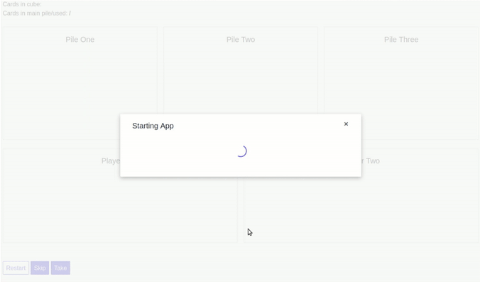

# Winston Cube Sim - PyScript Version

Check out the [DEMO](http://4dcu.be/WinstonCubeSimPyScript/) of this app.

This is the PyScript version of [Winston Cube Sim](https://github.com/4dcu-be/WinstonCubeSim), a Python app to simulate a Winston Draft with a preset list of cards like a cube.

